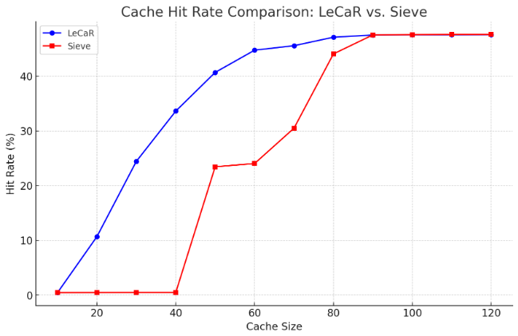
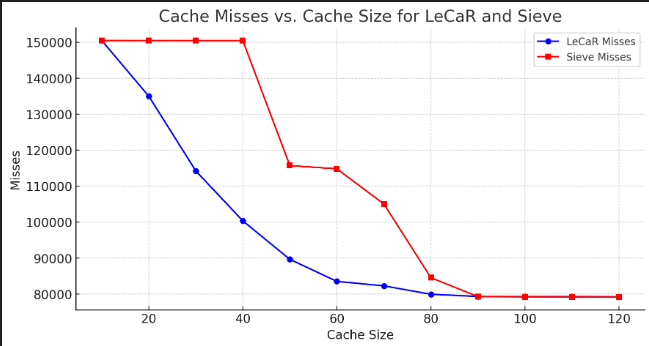
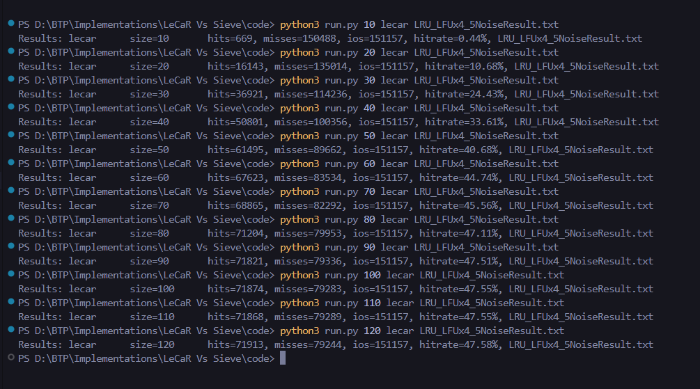
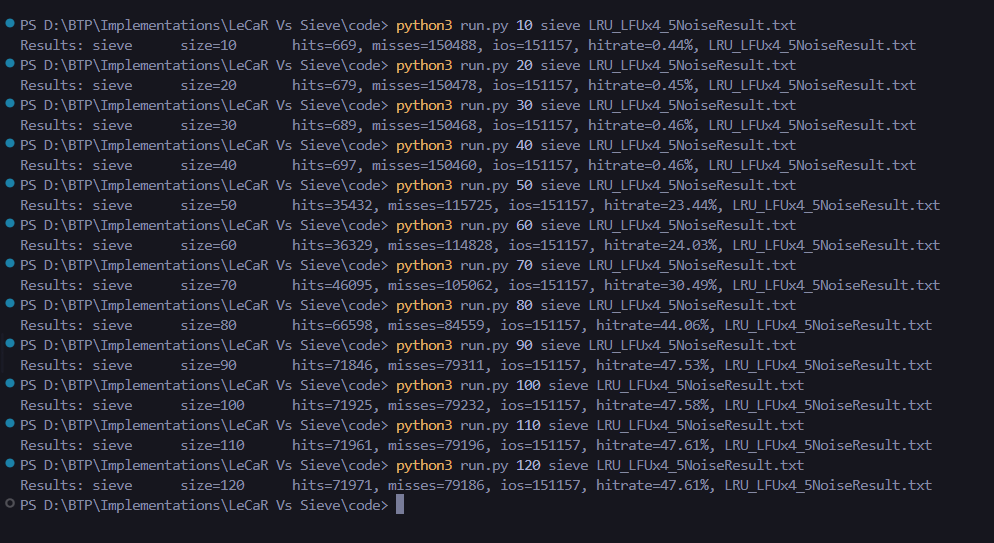

# LeCaR Caching

LeCaR (Least-Cache-Recent) is a hybrid caching policy that dynamically balances between **Least Recently Used (LRU)** and **Least Frequently Used (LFU)** strategies using **reinforcement learning** techniques. It improves cache replacement decisions by adapting to changing workloads.

## How LeCaR Works
1. **Two Policies**: Maintains both LRU and LFU strategies.
2. **Weighted Decisions**: Instead of strictly following one policy, it assigns weights to both and makes replacement decisions based on them.
3. **Reinforcement Learning**: Weights are adjusted dynamically based on observed performance using a **multi-armed bandit** approach.
4. **Adaptability**: Unlike static caching policies, LeCaR adapts to different workloads, ensuring better hit rates.

## Where is LeCaR Used?
- **Web caching** (e.g., CDNs, browsers)
- **Database caching** (e.g., Redis, Memcached)
- **Edge computing** (e.g., IoT networks)
- **Federated Learning** (where data access patterns change dynamically)
- **Storage systems** (e.g., SSD/HDD caching layers)

## Results

  
  

  
  

## Conclusion

### Cache Algorithm Performance Analysis: LeCaR vs. Sieve

In the experiments conducted for comparing the **LeCaR** and **Sieve** caching algorithms, the following observations were made:

#### LeCaR Algorithm:
- As the cache size increased, the **hit rate** progressively improved from 0.44% at size 10 to 47.58% at size 120.
- The **hit rate** saw a noticeable improvement, indicating that **LeCaR** benefits from larger cache sizes, reaching its peak performance with a consistent hit rate around 47.55% after size 100.
- The **misses** decreased as the cache size grew, which is consistent with the improved hit rate.

#### Sieve Algorithm:
- Similar to **LeCaR**, **Sieve** also showed an improvement in the **hit rate** as cache size increased, with the hit rate peaking at 47.61% at size 120.
- The **hit rate** and **misses** trend mirrored the performance of **LeCaR**, with **Sieve** maintaining a steady improvement from size 10 to 120.
- The **Sieve** algorithm appeared to perform slightly better in terms of hits compared to **LeCaR**, especially in the higher cache sizes (100 and 120).

#### Key Findings:
- Both algorithms show a steady increase in **hit rate** with larger cache sizes, with **LeCaR** and **Sieve** reaching near identical results in terms of the hit rate at the largest cache sizes (47.55% for LeCaR and 47.61% for Sieve).
- The **Sieve** algorithm performs marginally better than **LeCaR**, particularly for cache sizes above 50.
- The results indicate that increasing the cache size significantly improves cache performance, but the benefit levels off after a certain point.

#### Final Thoughts:
- Both **LeCaR** and **Sieve** are viable cache algorithms with improved performance at larger cache sizes.
- For applications requiring high cache hit rates, especially in larger datasets, **Sieve** may offer a slight edge over **LeCaR**.
